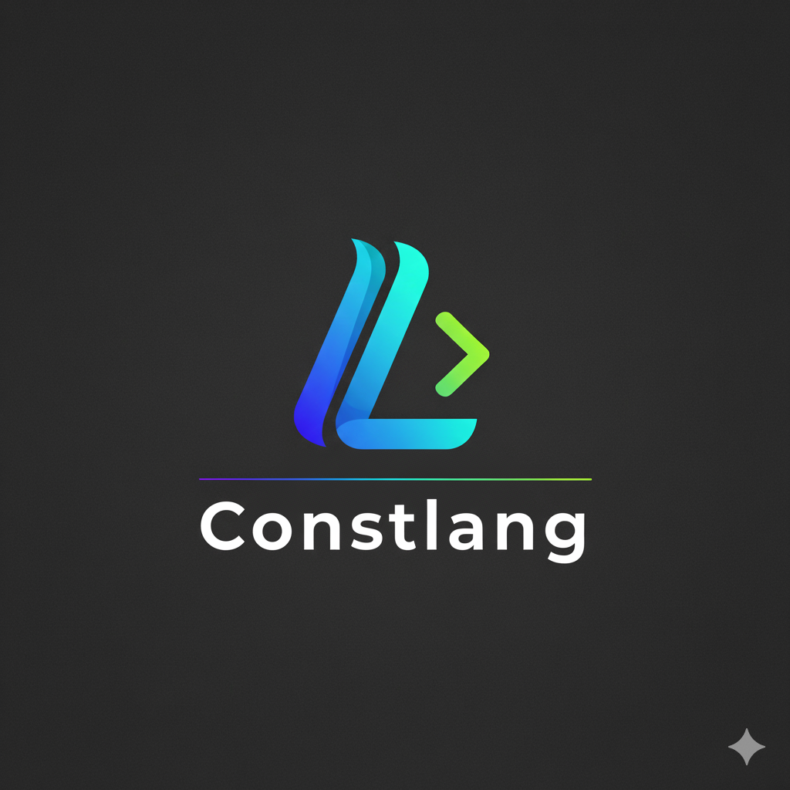

# {width=80}
# 🧠 ConstLang — Complete Command Reference

ConstLang is a lightweight browser-based programming language that compiles to JavaScript.

---

## ⚙️ Compiler Commands (3)

| Command | Description | Example |
|---------|-------------|---------|
| `compiler.add()` | Opens file picker to load `.clg` files. | `compiler.add();` |
| `compiler.start()` | Starts compilation process. | `compiler.start();` |
| `compiler.download()` | Downloads compiled JS file as `output.js`. | `compiler.download();` |

---

## 🧩 ConstLang Commands (16)

| Command | Description | JavaScript Output | Example |
|---------|-------------|-----------------|---------|
| `set <var> = <value>;` | Declare variable | `let <var> = <value>;` | `set x = 5;` → `let x = 5;` |
| `console.print(<expr>);` | Print to console | `console.log(<expr>);` | `console.print("Hi");` |
| `alert.data(<expr>);` | Browser alert | `alert(<expr>);` | `alert.data("Done");` |
| `addon() { ... }` | Embed raw JS | Inline JS | `addon() { console.log("Hi"); }` |
| `#import <file.clg>` | Import another `.clg` file | N/A | `#import utils.clg` |
| `#install <url>` | Download and include remote code | Inline JS | `#install https://cdn.com/lib.js` |
| `new.command()[ ... command() ... ]` | Define macro | Expands to JS template | *(See macro section)* |
| `if (condition) { ... }` | Conditional execution | Same as JS | `if (x>0){console.print(x);}` |
| `else if (condition) { ... }` | Additional conditional | Same as JS | `else if (x==0){console.print("Zero");}` |
| `else { ... }` | Fallback conditional | Same as JS | `else{console.print("Negative");}` |
| `for (init; condition; step) { ... }` | For loop | Same as JS | `for (let i=0;i<3;i++){console.print(i);}` |
| `while (condition) { ... }` | While loop | Same as JS | `while(x<5){x=x+1;}` |
| `do { ... } while (condition);` | Do-while loop | Same as JS | `do{x=x+1;}while(x<5);` |
| `switch (expr) { case ... }` | Multi-case selection | Same as JS | `switch(x){case 1:console.print("1");break;}` |
| `break` | Exit nearest loop/switch | `break;` | `break;` |
| `continue` | Skip iteration | `continue;` | `continue;` |

---

## 🧠 Macro Variable Syntax (1)

| Syntax | Description | Example | Output |
|--------|-------------|---------|--------|
| `${cmd^var}` | Macro placeholder for custom command variables | `new.command()[ print ${cmd^msg} command() console.log(${cmd^msg}); ] print "Hello";` | `console.log("Hello");` |

---

## 📘 Example Program

```clg
set x = 0;
while (x < 3) {
    console.print(x);
    set x = x + 1;
}

if (x == 3) {
    alert.data("Done!");
}

new.command()[
    print ${cmd^msg}
    command()
    console.log(${cmd^msg});
]

print "Hello ConstLang!";
